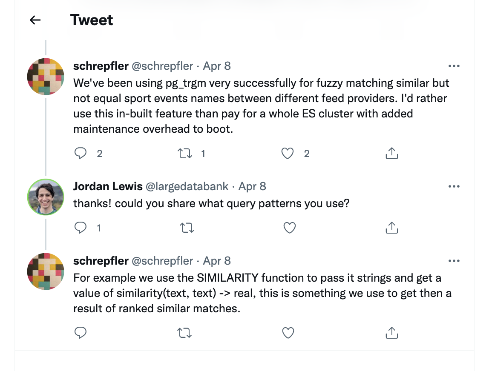

# An experiment in fuzzy matching, using SQL, with CockroachDB

## Inspiration

_We've been using pg_trgm very successfully for fuzzy matching similar but not
equal sport events names between different feed providers. I'd rather use this
in-built feature than pay for a whole ES cluster with added maintenance
overhead to boot._

## Reference

* [The tweet](https://twitter.com/schrepfler/status/1512434401652654085)
* [The film](https://www.rottentomatoes.com/m/hot_fuzz)
* [GIN (index) acceleration for `&&` operator](https://github.com/cockroachdb/cockroach/pull/77418)

